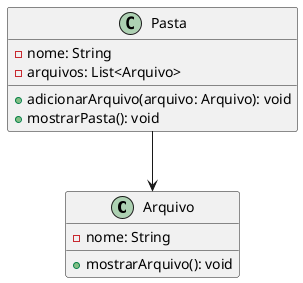
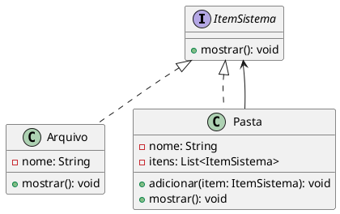

# Composite

## 5. Antipattern Composite

### Explicação

O antipattern relacionado ao Composite acontece quando o sistema precisa trabalhar com objetos individuais e grupos de objetos, mas trata cada caso de forma separada.

Isso pode gerar código repetido, dificuldade de manutenção e limitações na estrutura do sistema.

Neste exemplo, uma pasta consegue armazenar apenas arquivos. Caso seja necessário colocar uma pasta dentro de outra pasta, o código precisaria ser alterado.

### UML



### Código Java

#### Arquivo.java

```java
public class Arquivo {

    private String nome;

    public Arquivo(String nome) {
        this.nome = nome;
    }

    public void mostrarArquivo() {
        System.out.println("Arquivo: " + nome);
    }
}
```

#### Pasta.java

```java
import java.util.ArrayList;
import java.util.List;

public class Pasta {

    private String nome;
    private List<Arquivo> arquivos = new ArrayList<>();

    public Pasta(String nome) {
        this.nome = nome;
    }

    public void adicionarArquivo(Arquivo arquivo) {
        arquivos.add(arquivo);
    }

    public void mostrarPasta() {
        System.out.println("Pasta: " + nome);

        for (Arquivo arquivo : arquivos) {
            arquivo.mostrarArquivo();
        }
    }
}
```

#### Main.java

```java
public class Main {
    public static void main(String[] args) {

        Arquivo arquivo1 = new Arquivo("foto.png");
        Arquivo arquivo2 = new Arquivo("documento.pdf");

        Pasta pasta = new Pasta("Meus Arquivos");

        pasta.adicionarArquivo(arquivo1);
        pasta.adicionarArquivo(arquivo2);

        pasta.mostrarPasta();
    }
}
```

### Problema do Antipattern

O problema é que a classe `Pasta` só consegue armazenar objetos do tipo `Arquivo`.

Se o sistema precisar permitir uma pasta dentro de outra pasta, será necessário alterar a estrutura do código.

---

## 6. Pattern Composite

### Explicação

O padrão de projeto Composite permite tratar objetos individuais e grupos de objetos da mesma forma.

Neste exemplo, tanto `Arquivo` quanto `Pasta` implementam a interface `ItemSistema`.

Com isso, uma pasta pode armazenar arquivos e também outras pastas, formando uma estrutura de árvore.

### UML



### Código Java

#### ItemSistema.java

```java
public interface ItemSistema {
    void mostrar();
}
```

#### Arquivo.java

```java
public class Arquivo implements ItemSistema {

    private String nome;

    public Arquivo(String nome) {
        this.nome = nome;
    }

    @Override
    public void mostrar() {
        System.out.println("Arquivo: " + nome);
    }
}
```

#### Pasta.java

```java
import java.util.ArrayList;
import java.util.List;

public class Pasta implements ItemSistema {

    private String nome;
    private List<ItemSistema> itens = new ArrayList<>();

    public Pasta(String nome) {
        this.nome = nome;
    }

    public void adicionar(ItemSistema item) {
        itens.add(item);
    }

    @Override
    public void mostrar() {
        System.out.println("Pasta: " + nome);

        for (ItemSistema item : itens) {
            item.mostrar();
        }
    }
}
```

#### Main.java

```java
public class Main {
    public static void main(String[] args) {

        Arquivo arquivo1 = new Arquivo("foto.png");
        Arquivo arquivo2 = new Arquivo("documento.pdf");
        Arquivo arquivo3 = new Arquivo("musica.mp3");

        Pasta pastaPrincipal = new Pasta("Meus Arquivos");
        Pasta pastaMusicas = new Pasta("Músicas");

        pastaMusicas.adicionar(arquivo3);

        pastaPrincipal.adicionar(arquivo1);
        pastaPrincipal.adicionar(arquivo2);
        pastaPrincipal.adicionar(pastaMusicas);

        pastaPrincipal.mostrar();
    }
}
```

### Conclusão

Com o padrão Composite, objetos simples e compostos podem ser tratados da mesma forma.

Isso facilita a criação de estruturas hierárquicas, como pastas e arquivos, menus, componentes de tela e árvores de objetos.
